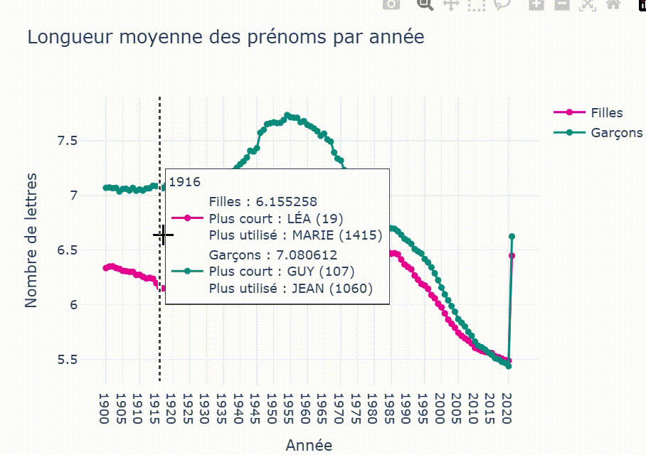
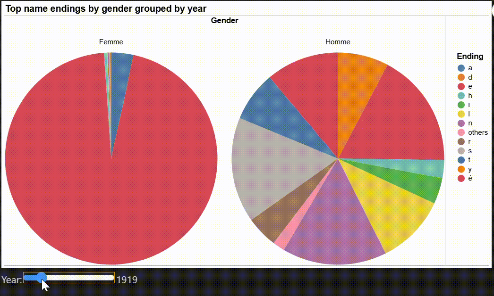

# Interactive Data Visualization 

This project contains three Jupyter notebooks that showcase different interactive visualizations based on the `dpt2020.csv` dataset.
The `dpt2020.csv` is dataset of French baby names.

## Requirements

- Python **3.12.9**
- [Jupyter Notebook](https://jupyter.org/)
- A Python package manager (e.g., `pip`)

## Installation

1. **Create a virtual environment** (recommended):
   ```bash
   python -m venv venv
   source venv/bin/activate  # on Linux/macOS
   venv\Scripts\activate     # on Windows
   ```

2. **Start Jupyter Notebook**:
```bash
jupyter notebook mini_project_1_baby_names.ipynb
```
Open and run the `mini_project_1_baby_names.ipynb` notebook to **view** and **interacte** the three main visualizations.

To explore further, check out each notebook in the `visualisation_notebooks/` folder for a more in-depth analysis.  
At the end of each notebook, you’ll find an interactive visualization that allows you to experiment with the data and explore custom insights.

## 1. Name Length by Gender Over Time



This line chart shows the **average number of letters** in baby names by gender from **1900 to 2020**. This time-based visualization offers insight into the **evolution of naming conventions**.

---

## 2. Most Popular Name per Department and Year


This animated **map of France** illustrates the **most popular name in each department** for a selected year, colored by **name length**. A slider allows for year-by-year and sex exploration This visualization highlights the **geographical diffusion of naming fashions**.

---

## 3. Final Letters of Names by Gender and Time Period



This pair of **pie charts** displays the distribution of **final letters** in baby names, separated by **gender** and **decade**. It provides a clear look into how **gendered naming norms** evolve across time.

---